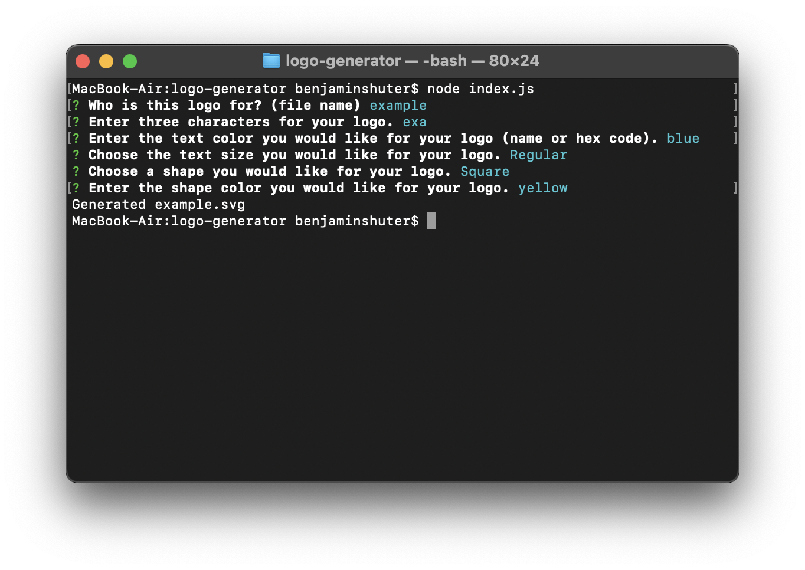
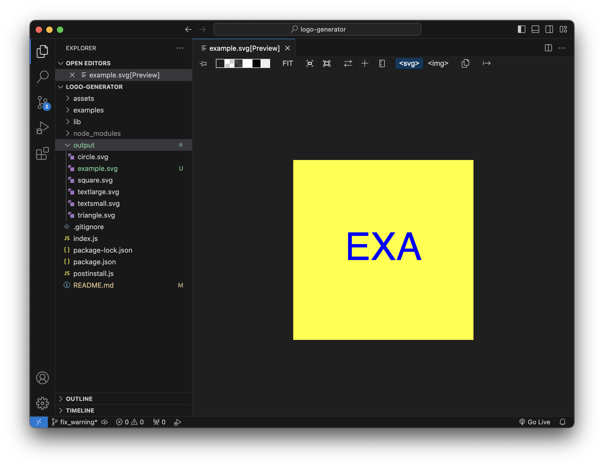

# logo-generator

## Description
A command line application that dynamically generates svg logo files based on user inputs.

## Installation
Download the contents of this repository.  Install node if needed.  Before using for the first time, run the script, "npm run postinstall" to avoid deprecation warnings while using the application.  If warnings about deprecation of punycode occur, run said script.

These warnings do not affect the performance of the application, but can be bothersome.

## Usage

Use the terminal to navigate to the application folder.  Enter the command: "node index.js".  Follow the instructions in each question prompt.  If instructions were followed correctly, a new svg logo file will appear in the "output" folder.

## Screenshots

## Video
[Usage Video](https://drive.google.com/file/d/1UPOKS-KUBYTbTCe43jQi63U4BPMecpz7/view)

## Work Cited
This repo adapts a [script](https://github.com/nodemailer/nodemailer/issues/1599) written by [Sanchyan Chakraborty](https://github.com/sanchyanchakraborty), to solve a similar punycode deprecation warning issue encountered while using Nodemailer.